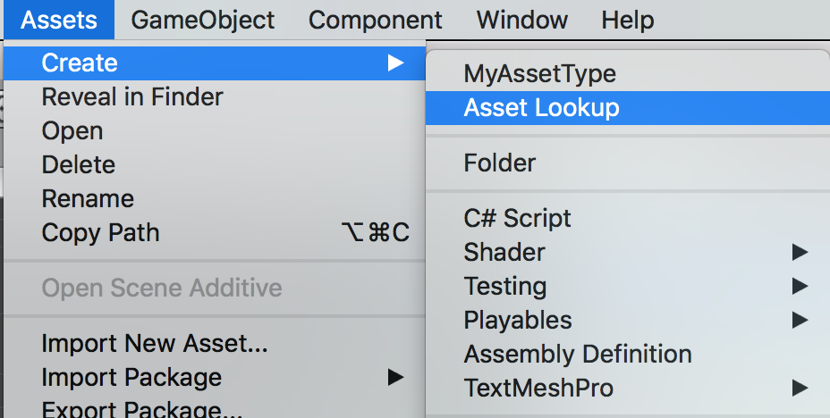
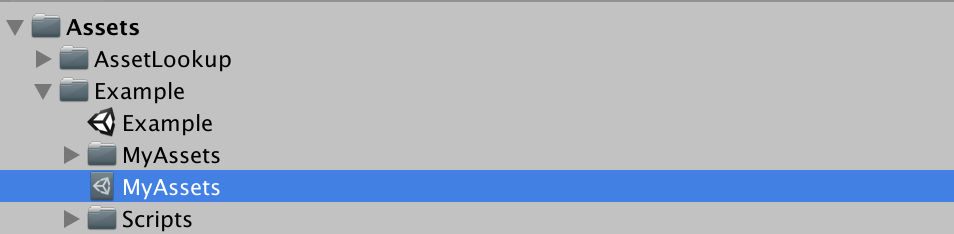
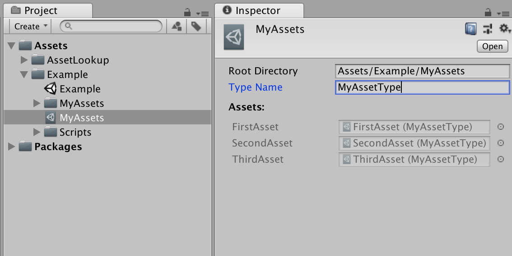
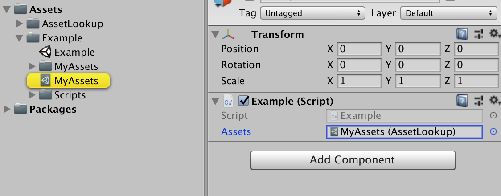
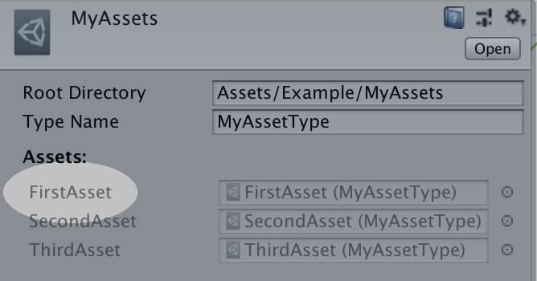

# UnityAssetLookup
The `AssetLookup` class acts as an alternative to Unity's `Resources.Load<T>()`. Since custom `ScriptableObject` classes don't work properly with Resources, and Unity recommend against using them at all, this should provide a similar functionality and API, but work better with Unity's core loading/streaming systems.

## Create a Custom Asset Type
First we need a custom asset type and a menu item to create instances of them in our assets folder.

```csharp
using UnityEngine;

[CreateAssetMenu(fileName = "NewAsset", menuName = "MyAssetType")]
public class MyAssetType : ScriptableObject
{
    public Vector3 pos;
    public float speed;
    public string message;
}
```

Once we have this, let's create a few for testing. Let's put these in a folder called `MyAssets`.


## Create an Asset Lookup

Now that we have these assets, we want them to be easy to load. To do this, we first have to create an `AssetLookup` for them.





The `AssetLookup` is a container that contains a list of assets that can be searched by name. To populate it, you just have to tell it what type of asset it should contain, and where it can find them.



The items below **Assets:** will be auto-populated. Instead of having to manually drag the references into the list, the script will automatically scan the **Root Directory** for any assets of type **Type Name** and populate the list.

It will do this as often as possible, including whenever you press the play button.

## Reference the Asset at Runtime

Now, if we want to locate any of these assets at runtime, we just need a reference to `MyAssets` in a script. For example:

```csharp
using UnityEngine;

public class Example : MonoBehaviour
{
    public AssetLookup assets;

    void Start()
    {
        var first = assets.Find<MyAssetType>("FirstAsset");
        var third = assets.Find<MyAssetType>("ThirdAsset");
        Debug.Log("FirstAsset: " + first);
        Debug.Log("ThirdAsset: " + third);
    }
}
```



The name you pass into `Find<T>()` is the name that appears to the left of the asset in the lookup:


